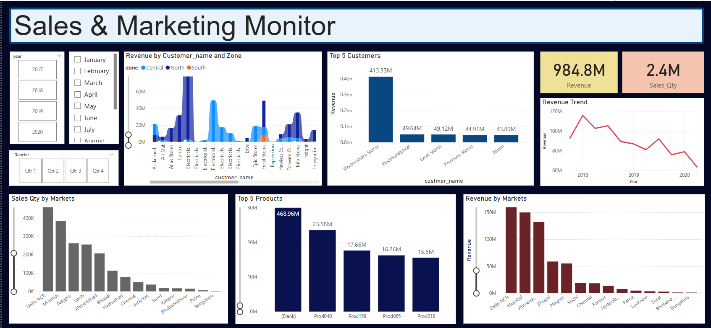

# 📊 Sales & Marketing Monitor

A Power BI dashboard designed to provide real-time insights into sales and marketing performance — enabling better decision-making, reduced manual effort, and enhanced visibility across teams.

---

## 🎯 Project Objective

To unlock key sales insights for decision support and automate manual data gathering for the Sales and Marketing teams.  
The goal: enable smarter, faster decisions and free up analyst time for value-adding tasks.

---

## 🧩 Key Features

- 📈 Dynamic sales KPIs (revenue, quantity sold, order counts)
- 🧠 Customer & product performance analysis
- 🌍 Market-wise sales breakdown
- 📅 Interactive filters for date, region, and product
- ⏱️ Real-time visibility into sales order trends

---

## ✅ Outcome Highlights

- 🔁 20% reduction in time spent on manual data gathering
- 💰 10% cost savings through improved sales decision-making
- 🧠 Empowered sales analysts to focus on value-adding insights

---

## 🛠 Tools & Technologies

- **Power BI**
- **Excel**
- **SQL (for data extraction & preprocessing)**

---

## 🖼️ Dashboard Preview

---

## 📁 Folder Structure

Sales-Marketing-Monitor/  
├── README.md  
├── Dashboard_Screenshot / Sales_Insights.png
├── SQL / db_dump.sql
└── Power BI / Sales Insights.pbix

---

## 💡 How to Use

1. Download or clone this repository.
2. Open the `.pbix` file in Power BI Desktop.
3. Replace sample data with your own (optional).
4. Explore dynamic filters, visuals, and KPIs.

---

## 📬 Contact

Tanushree Chaturvedi  
📧 tanushreechaturvedii@gmail.com

---

## 🔖 Tags

`#PowerBI` `#SalesDashboard` `#MarketingAnalytics` `#DataVisualization` `#BusinessIntelligence` `#SQL` `#Automation` `#PortfolioProject`

